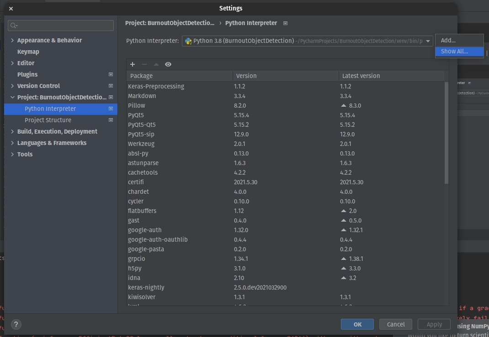
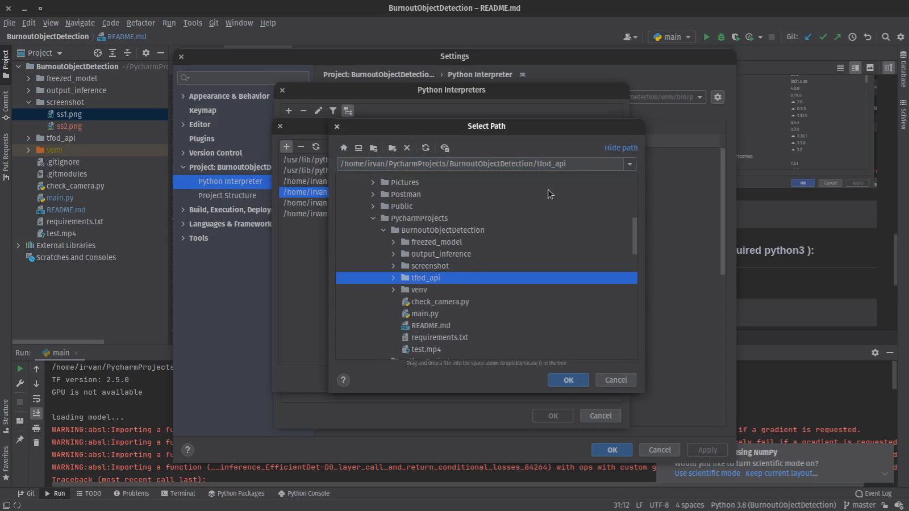
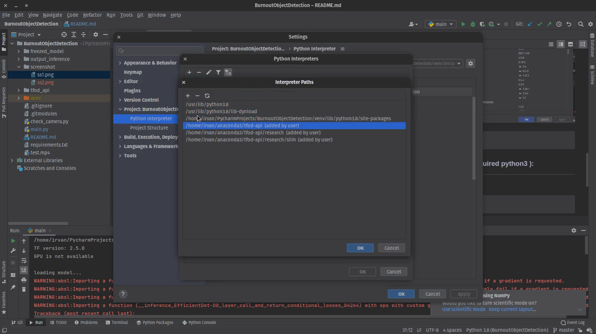

# Burnout PCB Object Detection
___
This model was trained with state-of-the-art objection detection algorithm which is SSD with EfficientNet-b0 + BiFPN feature extractor a.k.a EfficientDet (you can read the paper here https://arxiv.org/abs/1911.09070). To be precise, we use EfficientDet D0 512x512 as the pretrained model. We only used 81 data of pcb image burnt to train the model and split those data into 65 train set, 8 validation set, and 8 test set.

The technology that we used is Tensorflow 2.


___
## Steps
### 1. Clone Project 
```bash
git clone --recursive https://github.com/irvankadhafi/Burnt-PCB-Object-Detection.git
```
___
### 2. Make virtual environment (required python>=3.7 ):
#### Running this command in this project folder
```bash
python -m venv ./venv
```
it will created folder named `venv`
#### Activate created environment
_Linux_
```bash
source venv/bin/activate
```
_Windows_ (Using CMD in project folder)
```bash
venv\Scripts\activate.bat
```
___
### 3. Install requirements.txt (in project directory)
```bash
pip install -r requirements.txt
```
___
### 4. Set Environment Variable (choose one)
- Windows : Administrator CMD
```bash
set PYTHONPATH=<absolute-project-path>\tfod-api;<absolute-project-path>\tfod-api\research;<absolute-project-path>\tfod-api\research\slim
```

- Linux : Bash
```bash
export PYTHONPATH=<absolute-project-path>/tfod-api:<absolute-project-path>/tfod-api/research:<absolute-project-path>/tfod-api/research/slim
```

- PyCharm
```
File | Settings | Project: BurnoutObjectDetectio... | Python Interpreter
```

```
Click "Show All"
```
And the add tfod_api path



___
### 5. Installing Tensorflow Object Detection API
Sources :
- https://www.geeksforgeeks.org/ml-training-image-classifier-using-tensorflow-object-detection-api/
- https://blog.tensorflow.org/2021/01/custom-object-detection-in-browser.html
- https://gilberttanner.com/blog/tensorflow-object-detection-with-tensorflow-2-creating-a-custom-model

1. Go to `tfod_api/research` folder
2. Compile protos. <br> 
Create use_protobuf.py in ``research`` folder
```python
import os
import sys
args = sys.argv
directory = args[1]
protoc_path = args[2]
for file in os.listdir(directory):
    if file.endswith(".proto"):
        os.system(protoc_path+" "+directory+"/"+file+" --python_out=.")
```
3. Run use_protobuf.py that inside ``research`` folder
```bash
python use_protobuf.py  .\object_detection\protos\ <path to protoc file>
```
``<path to protoc file> `` is a folder where protobuf exist, on linux is ``/bin/protoc``, on windows you can download here https://github.com/protocolbuffers/protobuf/releases and then extract them.
4. Finishing Installing TFOD API (current diretory : `research`)
```bash
cp object_detection/packages/tf2/setup.py .
python -m pip install .
```
___
### Video that used to test
[test.mp4](https://drive.google.com/file/d/1-OycRKplMPSQ_kmSsQrU7viWgD79QnEM/view?usp=sharing)
