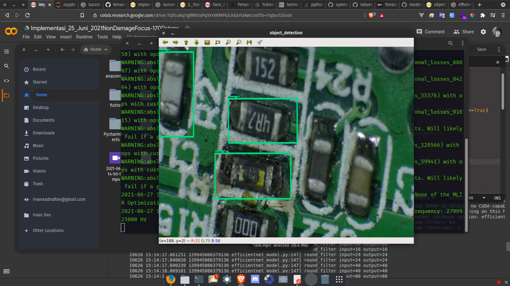

# BurnoutObjectDetection
This model was trained with state-of-the-art objection detection algorithm which is SSD with EfficientNet-b0 + BiFPN feature extractor a.k.a EfficientDet (you can read the paper here https://arxiv.org/abs/1708.02002). To be precise, we use EfficientDet D0 512x512 as the pretrained model.



### Clone Project 
```bash
git clone --recursive https://github.com/irvankadhafi/BurnoutObjectDetection.git
```


[comment]: <> (### Set Environment Variable &#40;Linux Ubuntu&#41;)

[comment]: <> (```bash)

[comment]: <> (export PYTHONPATH=/home/irvan/anaconda3/tfod-api:/home/irvan/anaconda3/tfod-api/research:/home/irvan/anaconda3/tfod-api/research/slim)

[comment]: <> (```)

### Video yang digunakan
[test.mp4](https://drive.google.com/file/d/1-OycRKplMPSQ_kmSsQrU7viWgD79QnEM/view?usp=sharing)

### How to make virtual environment (required python3 ):
___
#### Running this command in this project folder
```bash
python3 -m venv ./venv
```
it will created folder named `venv`
#### Activate created environment
_Linux_
```bash
source venv/bin/activate
```
_Windows_ (Using CMD in project folder)
```bash
venv\Scripts\activate.bat
```
